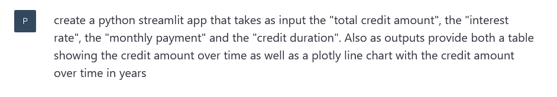

# Credit rate calculations

## Overview
This minimal streamlit application
provides a simple webapp to have a dynamic calculation of credit rates based on
several parameters:


NOTE: The app was basically completely created using ChatGPT
and only slightly adapted by me.
Chat GPT Prompt (11.03.2023):  
  

There's no guarantee that the calculated numbers are correct!

## Getting started
Clone the repository locally
create a conda or pip environment and run
```
pip install -r requirements.txt
```

in the main repository, then run

```
streamlit run main.py
```
and the app opens under http://localhost:8501/
